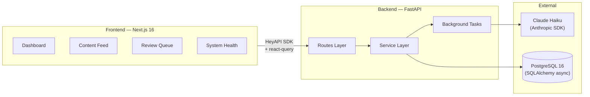
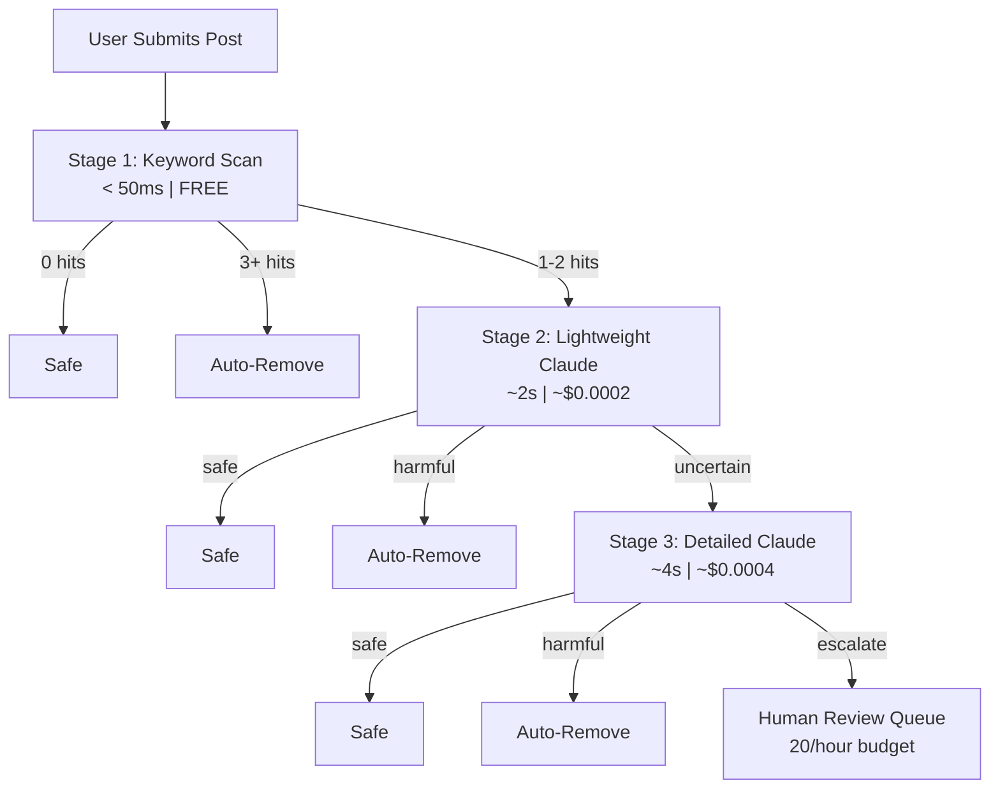
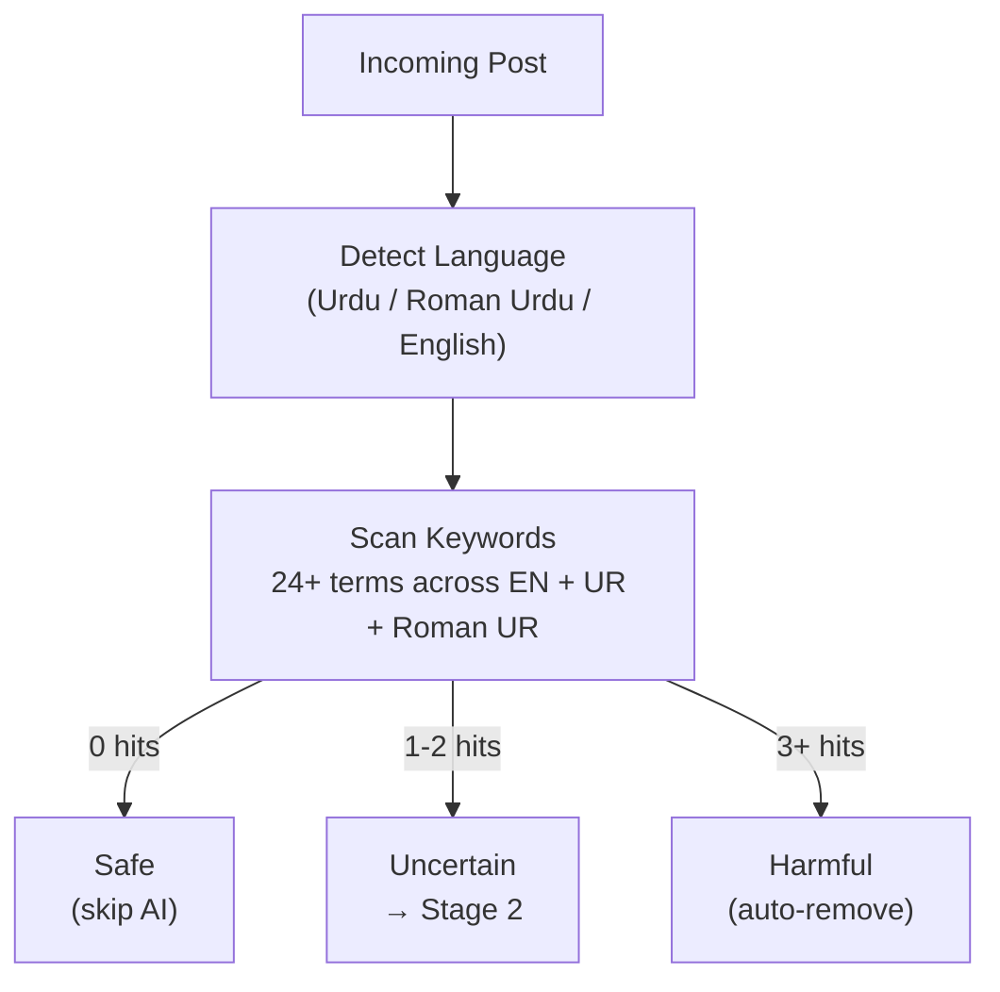
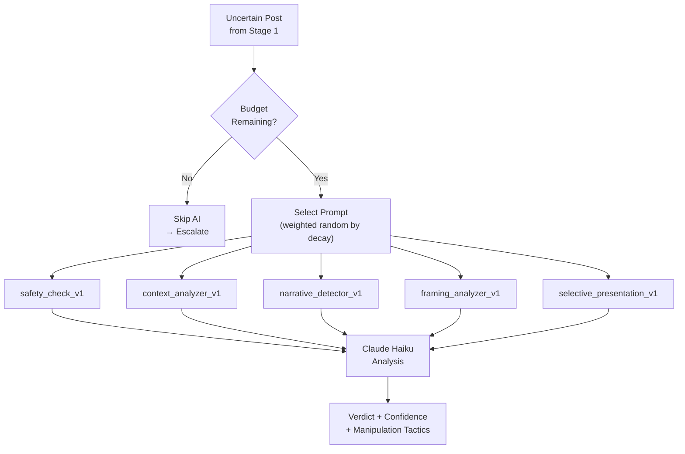
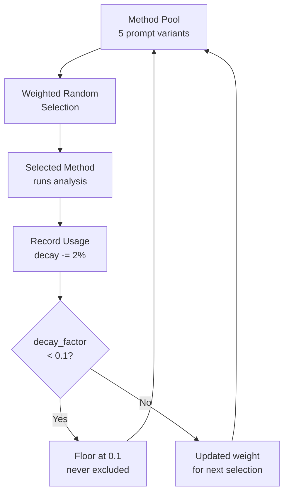
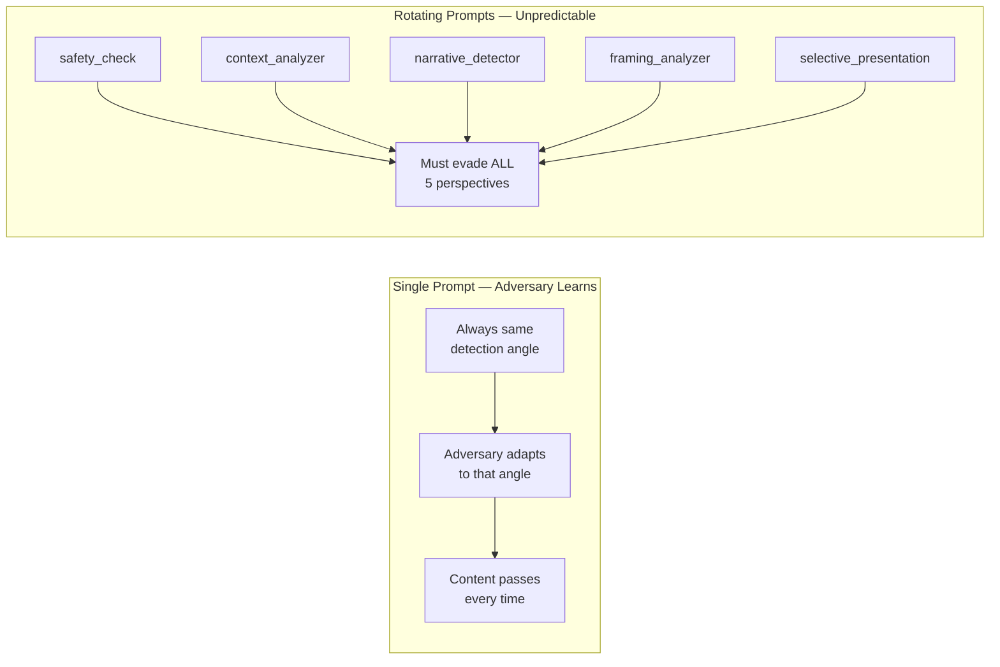
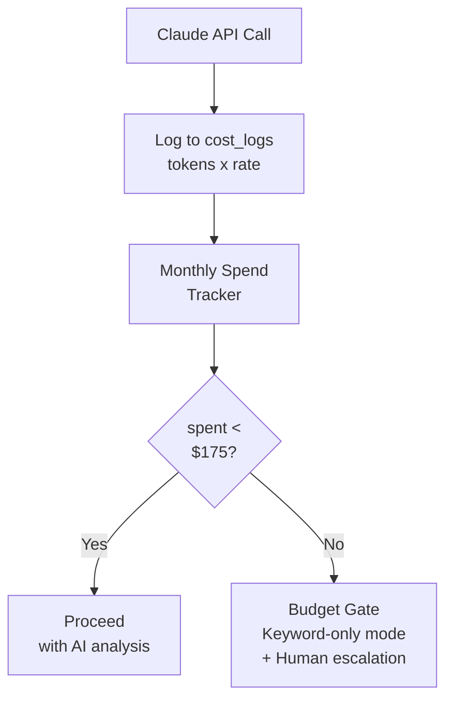
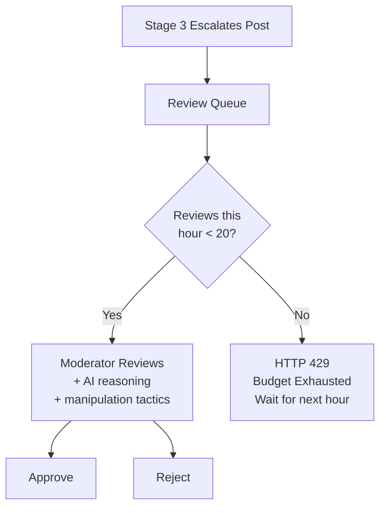
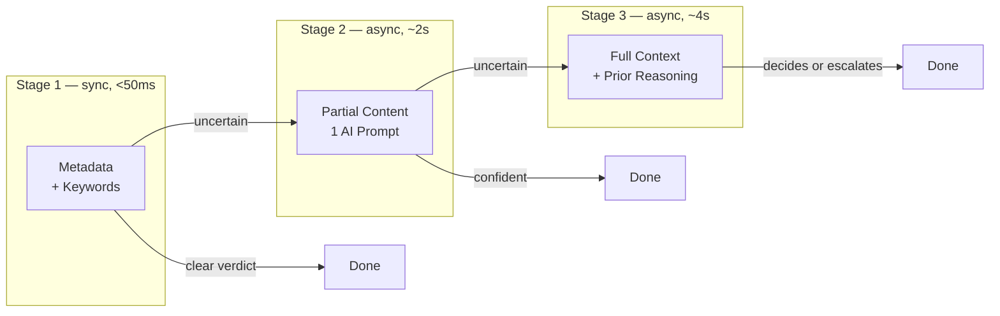

# Mind-Flayer Patch v2

**Adaptive Content Moderation Under Adversarial Constraints**

By **Stranger Syntax** — BNU Hackathon 2025

## The Problem

A large-scale platform is under attack — not through lies, but through **manipulation of context**. Content that is factually correct but deliberately framed to mislead causes real-world harm. Adversaries adapt in real time to detection strategies. The system must be **defensible, cost-aware, and adaptive**.

## Constraints

| Constraint | What It Means |
|---|---|
| Signal Collapse | Detection methods decay when overused |
| Partial Observability | Content arrives in stages, not all at once |
| Human Trust Budget | Only 20 human reviews/hour |
| Multilingual Ambiguity | Urdu, Roman Urdu, English — context-dependent |
| Poisoned Feedback | ~15% of human labels are noisy or adversarial |
| Budget Reality | PKR 50,000/month (~$175 USD) for everything |

## System Architecture



## Solution: 3-Stage Adaptive Pipeline



**Estimated cost: ~$14/month** (~8% of $175 budget). Room for 12x growth.

### Stage 1: Keyword Scan



- **Multilingual keywords**: English (`kill, murder, bomb, attack, terrorism, hate, slur, destroy`), Urdu (`قتل، بم، حملہ، دہشت، نفرت، تباہ`), Roman Urdu (`maar, qatal, bomb, hamla, dehshat, nafrat, tabah`)
- **Language detection**: Urdu script (Unicode `\u0600-\u06FF` > 30%), Roman Urdu markers (≥2 from 39-word set), fallback English

### Stage 2: Lightweight AI Analysis



Each prompt variant targets a different manipulation technique:
- `safety_check_v1` — explicit harm + contextual manipulation
- `context_analyzer_v1` — selective presentation, framing bias
- `narrative_detector_v1` — cherry-picked data, misleading juxtaposition
- `framing_analyzer_v1` — loaded language, implied causation, excluded viewpoints
- `selective_presentation_v1` — missing context, stats without base rates, partial quotes

### Stage 3: Deep Analysis + Human Escalation

Receives original content + language + Stage 2's reasoning. Performs full contextual evaluation considering cultural context, satire vs. genuine threat, and what context is deliberately missing. If still uncertain, escalates to the human review queue with full AI reasoning attached.

## Key Design Decisions

### Prompt Rotation with Decay



- Each use: `decay_factor = max(0.1, decay_factor - 0.02)`
- After ~45 uses a method hits the floor but is never fully excluded
- Adversaries can't predict which perspective will analyze their content

### Why Rotation, Not Round-Robin



### Budget-Aware Graceful Degradation



- **Budget OK** → Full 3-stage pipeline
- **Budget tight** → Stage 1 + 2 only (skip Stage 3)
- **Budget gone** → Stage 1 keyword-only + human escalation

The system never fully stops. It degrades to a less capable but still functional mode.

### Human Review Queue



- AI reasoning + detected manipulation tactics shown to reviewers
- Every decision logged with reviewer ID, timestamp, notes (audit trail)
- No auto-retraining on labels — poisoned feedback doesn't propagate

### Partial Observability



Stages 2 & 3 run as background tasks — the user gets an immediate response. Post status updates asynchronously.

### Contextual Manipulation Detection

Goes beyond keyword matching to detect:
- Cherry-picked statistics without base rates
- Emotional framing with real data
- Selective presentation / missing context
- Misleading juxtaposition
- Loaded language and implied causation

### Multilingual Support

- **Urdu script** detection via Unicode range (`\u0600-\u06FF`)
- **Roman Urdu** markers: hai, nahi, yeh, kya, mein...
- **Fallback**: English
- Language passed to every AI prompt for culturally-aware analysis

## Failure Modes

| Scenario | Impact | Containment |
|---|---|---|
| **Coordinated novel attack** — new tactic none of the 5 prompts cover | Harmful content passes all 3 stages | Human reviewers catch patterns → new prompt variants added |
| **Budget exhaustion attack** — adversary floods system to burn AI budget | Falls back to keyword-only detection | Rate limiting, keyword filter still catches obvious harm |
| **Review queue saturation** — 20+ ambiguous posts/hour during crisis | Escalated posts wait in queue | AI reasoning still available, most harm caught in Stages 1-2 |

## Tech Stack

| Layer | Tech |
|---|---|
| Backend | FastAPI, Python 3.12, SQLAlchemy 2.0 (async), Alembic |
| Frontend | Next.js 16, React 19, TypeScript, Tailwind CSS 4 |
| UI | shadcn/ui |
| Auth | NextAuth v5 + JWT/bcrypt |
| API Client | HeyAPI generated SDK + @tanstack/react-query |
| AI | Claude Haiku (Anthropic SDK) |
| Database | PostgreSQL 16 |
| Infra | Docker Compose, uv, Makefile |

## Quick Start

```bash
# 1. Start database + backend
make up

# 2. Install frontend deps & start dev server
make install-frontend
make dev-frontend

# 3. Seed test user + detection methods + sample posts
make seed
# => test@example.com / password123

# 4. Generate TypeScript API client
make generate-client
```

Or run everything at once:

```bash
make dev
```

## Frontend Pages

| Page | Path | Purpose |
|---|---|---|
| Dashboard | `/dashboard` | Stats cards, budget progress, content by status/language |
| Content Feed | `/content` | Submit posts, view moderation pipeline per stage, manual escalation |
| Review Queue | `/queue` | Escalated posts with AI reasoning, approve/reject, hourly budget counter |
| System Health | `/system` | Detection method decay bars, cost breakdown, reset controls |

## API Endpoints

| Route | Method | Endpoint | Purpose |
|---|---|---|---|
| Posts | POST | `/api/posts/` | Submit new post (triggers background pipeline) |
| Posts | GET | `/api/posts/` | List posts |
| Posts | GET | `/api/posts/stats` | Content statistics by status/language |
| Posts | POST | `/api/posts/{id}/escalate` | Manually escalate to review queue |
| Posts | POST | `/api/posts/moderate-pending` | Run pipeline on all pending posts |
| Moderation | GET | `/api/moderation/{post_id}/results` | Pipeline results for a post |
| Reviews | GET | `/api/reviews/queue` | Pending review items |
| Reviews | POST | `/api/reviews/` | Submit review decision (20/hr enforced) |
| Reviews | GET | `/api/reviews/budget` | Hourly review budget status |
| Detection | GET | `/api/detection/methods` | List detection methods with decay |
| Detection | POST | `/api/detection/methods/reset` | Reset all methods to full strength |
| Budget | GET | `/api/budget/summary` | Monthly spend, cost by stage, utilization |

## Project Structure

```
.
├── backend/
│   ├── app/
│   │   ├── main.py              # App factory, CORS, /health
│   │   ├── api.py               # Central router registry (/api prefix)
│   │   ├── config.py            # Pydantic settings (env vars)
│   │   ├── deps.py              # DI: DbDep, CurrentUserDep
│   │   ├── db/                  # Base, async/sync sessions
│   │   ├── routes/              # HTTP endpoints (thin layer)
│   │   │   ├── posts.py         # Submit, list, escalate posts
│   │   │   ├── moderation.py    # View moderation results per post
│   │   │   ├── reviews.py       # Human review queue + submit decisions
│   │   │   ├── detection.py     # Detection methods + decay reset
│   │   │   └── budget.py        # Cost tracking summary
│   │   ├── content/             # Post model, CRUD, language detection
│   │   ├── moderation/          # 3-stage pipeline, Claude calls, prompts
│   │   ├── detection/           # Method tracking, weighted selection, decay
│   │   ├── review/              # Human review queue, 20/hr enforcement
│   │   ├── budget/              # Cost logging, monthly spend, budget gate
│   │   ├── auth/                # Auth schemas, service, utils
│   │   ├── users/               # User model, schemas, service
│   │   └── schemas/             # Shared schemas (ErrorResponse)
│   ├── alembic/                 # Database migrations
│   └── scripts/                 # Seed scripts
├── frontend/
│   ├── app/
│   │   ├── (auth)/              # Public pages (login, register)
│   │   ├── (app)/               # Authenticated pages
│   │   │   ├── dashboard/       # Stats + budget overview
│   │   │   ├── content/         # Post submission + moderation viewer
│   │   │   ├── queue/           # Human review queue
│   │   │   └── system/          # Detection health + cost breakdown
│   │   └── api/auth/            # NextAuth route handler
│   ├── lib/api/                 # API clients + generated SDK
│   ├── components/ui/           # shadcn/ui components
│   └── providers/               # Session + Query providers
├── docker-compose.yml
├── Makefile
└── CLAUDE.md                    # AI assistant conventions
```

## Available Commands

| Command | Description |
|---|---|
| `make up` | Start database + backend |
| `make down` | Stop all services |
| `make dev` | Start everything (backend + frontend) |
| `make dev-frontend` | Frontend dev server only |
| `make logs s=backend` | Tail service logs |
| `make migrate` | Run pending migrations |
| `make makemigrations m="msg"` | Create new migration |
| `make generate-client` | Regenerate TypeScript SDK |
| `make seed` | Seed test data (user + detection methods + sample posts) |
| `make db-shell` | Open psql shell |
| `make lint` | Lint backend + frontend |
| `make format` | Format backend (ruff) |
| `make clean` | Remove containers, volumes, generated files |

## Environment Variables

Copy `.env.example` to `.env` (auto-copied on `make up`):

```bash
cp .env.example .env
```

Required in `.env`:

```env
ANTHROPIC_API_KEY=sk-ant-...    # For Claude Haiku moderation calls
```

Frontend env in `frontend/.env.local`:

```env
NEXTAUTH_SECRET=nextauth-secret-change-me
NEXTAUTH_URL=http://localhost:3000
NEXT_PUBLIC_API_URL=http://localhost:8000
BACKEND_URL=http://localhost:8000
```

## API Docs

With the backend running:

- Swagger UI: http://localhost:8000/docs
- ReDoc: http://localhost:8000/redoc
- Health check: http://localhost:8000/health
